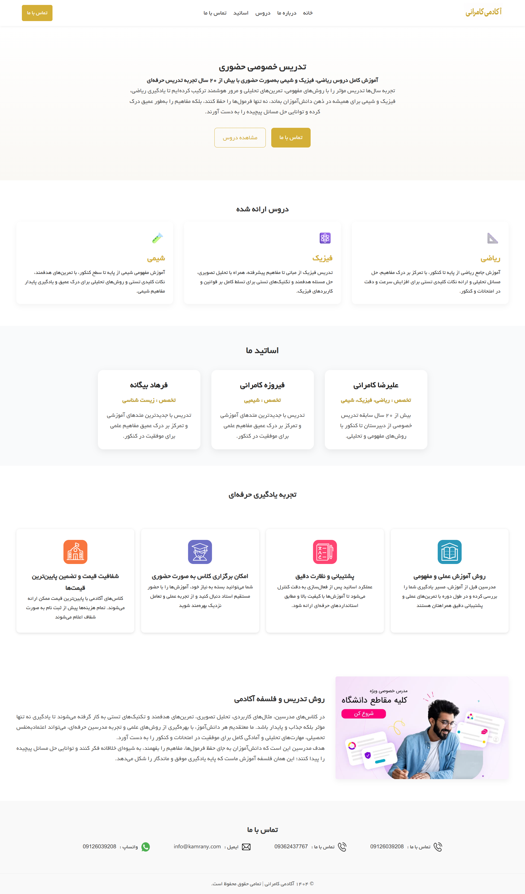

# 🏫 Kamrani Academy - Single Page Educational Website

**Kamrani Academy** is a modern, responsive single-page educational website built to showcase courses, instructors, and contact information for an academic institution.  
This project demonstrates a real-world web development scenario using **Next.js**, modular components, and clean UI design.

---

## 💡 Features

- 🏠 **Single-page layout** with smooth navigation  
- 📚 **Courses section**: Math, Physics, Chemistry with detailed descriptions  
- 👩‍🏫 **Instructors section**: Profiles with expertise and experience  
- 🎯 **Learning experience**: Highlights teaching philosophy, practical exercises, and personalized support  
- 📞 **Contact section**: Phone, email, WhatsApp, and location  
- 📱 **Responsive design**: Works on mobile and desktop  
- ⚡ **SEO & Accessibility ready** (Next.js optimization)

---

## 🛠️ Tech Stack

| Technology | Use |
|------------|-----|
| Next.js 13+ | React framework for server-side rendering |
| React | Frontend components |
| CSS Modules | Styling |
| React Icons | Icons for UI enhancement |
| Vercel | Deployment (optional) |

---

## 📸 Screenshot



> Replace with an actual screenshot of the site.

---

## 🚀 Live Demo

👉 [View Live Site](https://kamraniacademy.ir/)

---

## 📦 Getting Started

To run this project locally:

```bash
git clone https://github.com/sinaabolhasani718/kamraniacademy.git
cd kamraniacademy
npm install
npm run dev
